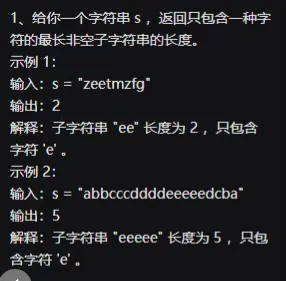

## 一面

1. 语义化标签有哪些？作用？为什么要使用语义化标签？
2. 组长需要哪些方面的能力
3. 前端常用的存储有哪些？
4. b 包的理解？用在哪些地方？
5. typeof 与 interface 的区别
6. 泛型？使用场景
7. 异步编程的核心机制是啥
8. fiberNode 的节点更新机制
9. hooks 机制的优势
10. vue2 与 vue3 实现的差异
11. CICD 做了些啥
12. 项目中做了哪些优化
13. vite 与 webpack 的区别
14. 构建工具了解 Rust 相关的吗
15. 常见的为前端方案有些？微前端使用中遇到的问题？怎么实现传值？css/js 沙箱
16. 为啥使用 Monorepo?Workspace 有啥优势？
17. 做过哪些性能优化或者说怎么去做性能优化
18. 针对网络与图片处理还有哪些优化
19. webview 做过通信吗
20. 介绍低代码引擎、介绍流程引擎及整体实现？难点在哪里？做的优化
21. 小程序、h5 分端差异化产出怎么实现
    比如一套 h5 适配微信浏览器、微信浏览器、pc 端、小程序。
    比如弹窗在在 h5 与 pc、小程序中操作逻辑不一样，怎么分端产出
22. 响应式布局的理解
    flex、gride、vw、rem、媒体查询
23. node 了解哪些？中间层做过哪些？日志这块怎么做
24. 编程工具熟悉哪些？怎么进行 vibing code、怎么建立规范的？上下文过长怎么办？
25. websocket、sse、长轮询、特点、缺点
26. 两道手写题：

● 发布订阅

- 
